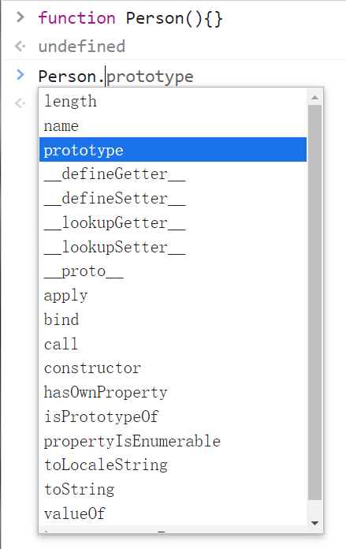
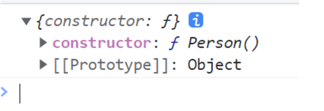
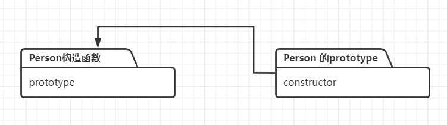
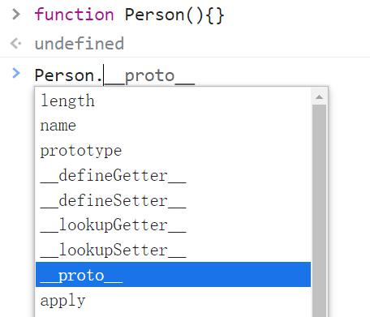
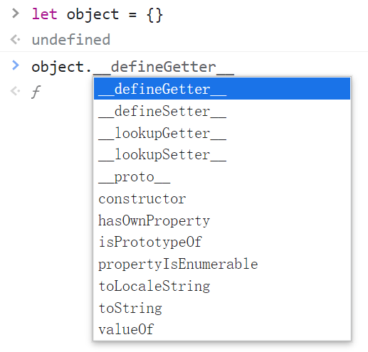
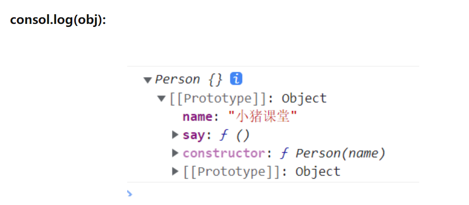
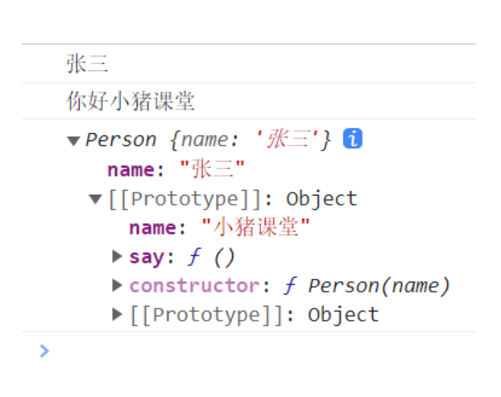
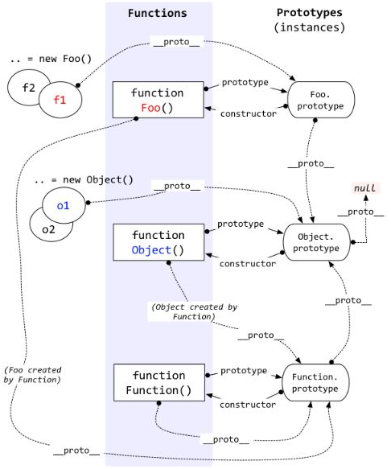

### 前言

原型和原型链基本上是基础前端面试必问的问题之一，虽然这是一个非常基础的知识点，但是往往工作了好几年的前端程序员都理不清楚。或许你大概知道在Javascript中有原型的概念，也知道有原型链的存在，但是如果面试官让你说出来，你可能会把自己都说蒙圈！

**总体原因：对原型和原型链理解得不够透彻！**

### 1.为什么要学会它们？

如果你学过后端语言比如Java等等，那么你应该知道它们都是面向对象的开发方式。面向对象有许多特点，其中继承就是其中一个。在Java中通常通过类class的方式来实现继承。

而我们的JavaScript语言是一门基于对象的语言，它不是一门真正的面向对象编程的语言。虽然ES6提出了class编程的方式，但它终究只是一个语法糖，class编译之后其实就是一个函数。

那么在JavaScript中如何实现继承呢？这个时候就用到了原型和原型链，它们非常巧妙地解决了**在JavaScript中实现继承的问题！**

### 2.原型和原型对象

在JS中，我们所说的原型通常是针对于函数而言的，当然构造函数也是一个函数。

我们都知道函数也是一个对象，是对象那么它就有属性，在JS中，我们所创建的每一个函数自带一个属性prototype，我们就把prototype称为原型，有些小伙伴也把它称之为“显示原型”，反正就一个意思。

这个prototype它指向了一个对象，你可以把prototype想象成一个指针，或者更简单的理解为prototype的属性值（键值对）。prototype指向的这个对象我们就称之为原型对象，通常大家就直接将prototype理解为原型对象。

为了让大家更好理解，我们可以在浏览器控制台简单查看一下函数的prototype，如下图：



上图中我们声明了一个Person函数，既然函数是对象，那么我们就可以使用“.”来查看它的属性，可以看到有一个prototype属性，这个是每一个函数都有的。

我们在代码里面打印出来看看，示例代码如下：

```js
<script>
  function Person() { }
  console.log(Person.prototype)
</script>
```

**输出结果：**



我们可以看到原型对象prototype里面有一个constructor属性，它指向了Person构造函数，我们可以画一张图来理解：



**总结**

其实原型或者原型对象没有那么复杂，总结下来就下面几点：

每个函数都有prototype属性，被称作原型。
prototype原型指向一个对象，故也称作原型对象。

### 3.prototype和__ptoto__

很多小伙伴把prototype和__proto__混为一潭，其实这是两个维度的东西。prototype的维度是函数，而__proto__的维度是对象。__proto__是每个对象都有的属性，我们通常把它称为"隐式原型"，把prototype称为"显式原型"。

有些小伙伴可能有疑惑，函数也是一个对象，那它是不是也有__proto__属性呢？答案是肯定的，我们可以通过浏览器控制台验证一下。

#### **Function：**



#### **对象：**



我们可以看到函数有prototype和__proto__两个属性，而对象只有__proto__属性。接下来我们再来看看__proto__属性有什么呢？

在浏览器控制台进行测试：


上图中我们发现了一个新的属性：[[Prototype]]。很多小伙伴会误认为这个就是我们所说的显式原型prototype，其实不是的，官方对于这个属性其实有解释，我们这里通俗的给大家解释一下：

> [[prototype]]其实就是隐式原型__proto__，因为各大浏览器厂家不同，所以取了别名罢了，大家只需记住这个和__proto__一样即可。
上段代码中我们定义了一个空对象，它有一个隐式原型[[prototype]]，隐式原型的constructor指向了构造函数Object。

**总结**

> **proto__和prototype不太一样，一个是对象拥有的隐式原型，一个是函数拥有的显式原型，这里我们简单总结一下__proto**：
>
> - 通常被称作隐式原型，每个对象都拥有该属性。
> - [[prototype]]其实就是__proto__。
>

### 4.原型链

前面两节我们主要介绍了prototype和__proto__，那么它们之间有什么关系呢？

为了理清楚之间它们的关系，我们拿出一段示例代码：

```js
<script>
  function Person(name) {
  }
  // 在函数的原型上添加变量和方法
  Person.prototype.name = "小猪课堂";
  Person.prototype.say = function () {
    console.log("你好小猪课堂");
  }

  let obj = new Person();
  console.log(obj.name); // 小猪课堂
  obj.say(); // 你好小猪课堂
</script>
```

上段代码大家应该都很熟悉，我们声明了一个构造函数Person，其实就是一个函数。我们知道函数的prototype是一个对象，我们就可以往这个对象上添加东西，所以我们就直接往函数的原型上添加了变量和方法。

接着我们使用new关键词创建一个Person构造函数的实例对象，分别打印name和调用say方法，大家会发现输出结果其实都是Person原型上的东西。

这是为什么呢？这其实就和我们的原型链有关了，我们把obj打印出来看看。



我们会发现obj对象上面其实并没有name属性和say方法，但是在它的隐式原型[[prototype]]上有name和say，而且我们会发现obj的[[prototype]]中的constructor指向的式它的构造函数Person。

所以我们大胆的做一个猜想：obj的隐式原型__proto__是否和构造函数Person的显式原型prototype相等呢？我们用代码证实一下：

```js
console.log(obj.**proto** === Person.prototype) // true
```

我们发现它们两个果然相等！

接下来我们修改一下我们的代码，我们在obj对象上添加一个name属性，看看会输出什么。

代码如下：

```js
<script>
  function Person(name) {
    this.name = name;
  }
  // 在函数的原型上添加变量和方法
  Person.prototype.name = "小猪课堂";
  Person.prototype.say = function () {
    console.log("你好小猪课堂");
  }

  let obj = new Person("张三");
  console.log(obj.name); // 张三
  obj.say(); // 你好小猪课堂

  console.log(obj)
</script>
```

**输出结果：**



上段代码中我们obj上面有自己的name属性了，这个时候输出的就是obj自带的name属性。到这里我们又可以做一个大胆的猜想：**obj对象想要获取name或者say，首先判断自己的属性当中有没有，如果没有找到，那么就在__proto__属性中去找，而这个时候__proto__与Person的prototype是相等的，也就是__proto__指向Person，那么便可以找到name和say。**

上面的猜想非常的正确！我们还可以在上面的猜想上扩展一下，既然函数的prototype是一个对象，那么它必然有__proto__，当我们在函数的原型上没有找到的时候，我们又继续查找prototype的__proto__，以此下去，直到找到或者__proto__没有指向某个构造函数为止。

上面的查找过程是不是很像链式查找啊！而这就是我们所说的原型链，而且我们发现查找的过程主要是通过__proto__原型来进行的，所以__proto__就是我们原型链中的连接点。

**总结：**

上面的查找的过程形成的一条线索就叫做原型链，大家可以把原型链拆开来理解：原型和链。

- 原型就是我们的prototype
- 链就是__proto__，它让整个链路连接起来。
想要理解原型链，我们还得理解__proto__指向哪儿，也就是说它指向那个构造函数，比如上面的obj对象的__proto__指向的就是Person构造函数，所以我们继续往Person上查找。

最后我们上一张经典的图，相信大家能看懂了：



上面这张图看似很复杂，但是我们理解了prototype和__proto__之后很简单，大家按照下面的思路去看上面这张图会很简单的：

1. 上面很多虚线，我们发现虚线上都有__proto__属性，所以可以看出来__proto__就是一个连接的作用。
2. 上图中无非有三个构造函数：Foo、Object、Function，我们都知道每个函数都有一个prototype显示原型，而且这个显示原型指向了自身这个构造函数。
3. 接着我们在看图中的new关键字，我们知道new创建的对象都有一个__proto__隐式原型，而且这个隐式原型执行了它的构造函数，也就是__proto__ === prototype。
4. Foo的隐式原型__proto__指向的是Function的prototype，因为函数是属于Function这个构造函数的。所以上图中的Foo和Object的__proto__都指向了Function的prototype。

**总结**

利用原型链这种链式查找的方式，我们就巧妙地实现了继承！要理解原型和原型链其实不难，主要是大家还是要有面向对象的思想，比如通过new关键词创建实例，构造函数是什么？
